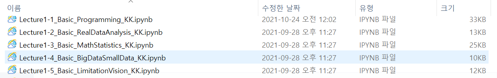
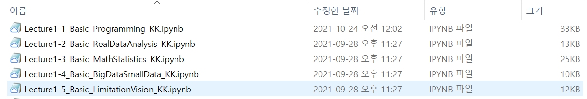

# 수업준비

## 내정보: 아래 채널을 통해 수다/면담 가능
- Office: +82-32-835-8525,  Email: kk@inu.ac.kr
- Kakaotalk Channel: http://pf.kakao.com/_Exfqqb (카카오톡 채널 "김경원 교수" 검색으로도 가능)
- Homepage: https://sites.google.com/view/kkim

## 강의자료: 아래 장소에서 강의 전 다운로드 및 상태체크 권장
- (이론+실습) https://github.com/cheonbi/DigitalPlatform
- (이론+영상) 인천대학교 학습관리시스템(INU LMS)

## (온라인) 강의상태 체크
1. (화면출력 확인) 화면에 공지나 강의자료가 보이면 "모니터 이상무"
2. (스피커출력 확인) 음악소리가 들리면 "스피커 이상무"
3. (마이크출력 확인) 본인들 대화에 내가 참여하면 "마이크 음소거 실행"

## 수다타임: 근황토크 + 캐주얼토크 + 질문/면담 등
- 수업전 ~ 수업시작까지, 수업중에는 채팅 또는 언제든 가능, 수업종료 ~ 배고플 때까지
- 시스템 내 질의응답게시판이나 메시지로도 가능
- 전화, 이메일, 카카오톡채널로도 가능
- 인천대 스타인유 상담신청 : https://starinu.inu.ac.kr/index.do

## 출석체크
- (오프라인) 불시에 랜덤 체크
- (온라인화상) 수업 중 "참가자" 목록 캡쳐본 기준으로 반영
- (온라인동영상) 시스템이 자동 체크

---

# Q&A (수업전반)
**Q. 교재는 강의계획서에 있는 그대로 사용하나요?**

A. 그렇습니다. 하지만 꼭 구매를 할 필요는 없습니다.    
교재 내용을 제가 반영하여 강의자료를 만들 것이며, 본인 스스로 소장가치가 있다고 생각되는 경우에만 책 구매를 추천합니다.    
아마도 이론/실습 모두 책에 없는 내용이 수업에 많이 반영될 것입니다.    

**Q. 수업시간과 쉬는시간 배치는 어떻게 되나요?**

A. (주간수업) 쉬는시간 없이 진행되며 1회 75분 수업으로 1주당 2회입니다.    
(야간수업) 1회 50분 수업이 연달아 3회 반복되며, 수업사이에 10분의 쉬는시간을 배정합니다(50분+10분+50분+10분+50분).    
상황에 따라 수업시간이 늘어나거나 줄어들 수도 있고 쉬는시간 총20분을 한번에 쉴수도 있습니다.

**Q. 매회 강의가 어떻게 진행되는지 어떻게 알 수 있나요?**

A. 본 강의는 "화상+동영상" 혼합강의며, "화상수업(Zoom/Webex)"이 기본이고,    
동영상 강의시 사전에 공지사항/메시지/이메일/문자 등을 활용하여 공지합니다.    

**Q. Zoom 링크에 암호가 필요하다고 나오는데 어떻게 하나요?**

A. 제가 보내드리는 링크에 암호가 포함되어 있어서, 클릭시 바로 들어올 수 있습니다!    
하지만 소프트웨어 버전 차이로 암호를 요구할 때가 있는 걸로 확인됩니다. 그때는 보내드린 링크의 "pwd=암호"를 사용할 수 있을겁니다. 
(예시: https://us02web.zoom.us/j/85354349054?pwd=QzNPSkZvM2NqZEJtVkt6SGxCb0RSZz09)

**Q. 강의자료를 강의 전 공유가 가능한가요?**

A. 수강신청 변경기간인 첫주 강의 이외의 나머지 강의들은 대부분 강의 전 자료를 우선 공유합니다.    
그리고 외부 기업 자체 자료가 포함된 공개하기 어려운 자료는 포함되지 않을 수 있습니다.    

**Q. 화상강의의 경우 출석체크는 어떻게 하나요?**

A. (오프라인) 출석보단 수업이 더욱 중요한 바 매일 체크하진 않겠지만, 랜덤하게 체크하여 반영할 예정입니다.    
(온라인화상) Webex 또는 Zoom 을 사용하는데 수업 중 "참가자" 목록 캡쳐본 기준으로 반영할 예정입니다.
(온라인동영상) 시스템이 자동으로 출결을 체크합니다.

**Q. 개인적인 사정으로 강의에 늦어도 괜찮을까요?**

A. 늦어도 저는 상관이 없습니다만, 출결문제나 강의 이해도가 낮아질 수 있는 문제가 발생할 수 있으니 유념하시기 바랍니다.

**Q. 화상강의의 경우 얼굴이 공개되야 하나요?**

A. 공개를 해주면 학생들과 대면강의하는 느낌이 들어 좋습니다만, 학생들의 자율에 맡길 예정입니다. 선택 사항입니다.

**Q. 화상강의 영상도 공유가 가능한가요?**

A. 동영상은 모두 업로드되며 화상강의도 공유를 하려고 합니다.    
하지만 화상수업 녹화가 되기고 하고 안되기도 하고 해고 환경상 오류가 발생될 수 있습니다.    
또한 화상강의 공유는 초상권 및 개인정보 문제로 원칙적으로 불법입니다.    
그럼에도 복습해고 싶다고 화상수업 녹화본을 요청하시는 분이 계시면 녹화상태가 양호하고 가능한 경우만 업로드 하겠습니다.    
(단, 화상수업 기준으로 출석 체크를 할 것이고 업로드된 화상수업 녹화본을 수강한다고 하여 출석이 인정되지는 않습니다.)

**Q. 화상강의 영상이나 동영상 업로드는 언제되나요?**

A. 동영상은 수업 전에 업로드 하려고 합니다.    
화상강의는 수업후 바로 업로드는 어렵습니다. 수업 종료 후 별도 인코딩도 해야 하고 상태나 법적이슈도 체크해야하기 때문입니다.    
즉, 동영상은 수업전 업로드, 화상수업 영상은 최대한 수업 후 빠르게 업로드 하려고 합니다.    

**Q. 동영상의 수강 가능 기간은 언제부터 언제까지 인가요?**

A. 기본적으로 시스템에선 1주일이 부여됩니다.    
주차별 학습활동에 영상 길이와 열람이 가능한 날짜와 시간이 나타납니다.    
그 기간 내에 반드시 수강하셔야 불이익이 없습니다.

**Q. 수강생 증원이 가능할까요?**

A. 인천대학교 내규에 따릅니다.    
통상 이수학점에 지장이 될 수 있는 4학년 또는 필수과목에 한해서 증원이 가능한걸로 압니다(21년 9월 기준).

**Q. 수강신청 변경 등으로 1주차 수업을 참석하지 못했는데 불이익이 있을까요?**

A. 1주차 수업은 강의 "배경과 필요성"에 대한 것으로, 향후 강의 이해도에 영향을 줄 수 있습니다.    
하지만, 그외 출석체크는 하지 않으며 평가에 직접적인 반영은 되지 않을 것입니다.    

**Q. 실습과 프로젝트의 차이가 무엇인가요?**

A. 실습은 "단독"으로 "강의"에서 배운 내용을 "활용"하는 문제가 될 것이며,    
그 외에 팀으로 작성하거나 강의에서 커버하지 않은 데이터나 내용을 활용하는 문제 등은 프로젝트로 분류하였습니다.    
팀프로젝트를 원하는 수강생 등을 고려하여 필요시 프로젝트를 진행할 것입니다.    

**Q. 강의와 관련된 궁금증은 어떻게 대응하시나요?**

A. 시스템 내 질의응답 게시판/메시지, 그 외 전화/메일/카카오톡채널/스타인유 등에 작성하면 확인하는대로 답변 드립니다.

**Q. 데이터 또는 Python 경험이 없는데 괜찮을까요?**

A. 데이터분석 도구 뿐 아니라 일상 생활에서 노트북이든 연필이든 자동차든 도구를 사용법을 익히는게 어렵게 느껴지는 건,    
대부분 난이도가 높아서라기 보다 익숙하지 않은데도 반복학습하지 않고 보기만 하는경우가 대부분입니다.    
마찬가지로 "도구"를 다루는 것은 여러분들의 충실한 "반복"만으로 뭐든 해결될 문제입니다.

**Q. 공휴일에도 수업을 하나요?**

A. 공휴일에는 가족과 사랑하는 지인들과 좋은 추억 만드시기 바랍니다!    
보강이 필요하면 별도 동영상 등으로 대체하겠습니다.

---

# Q&A (파이썬 실습)
**Q. Anaconda 설치시 폴더 선택에서 에러로 진행이 되지 않는데 어떻게 하나요?**

A. 사용자명이 한글인 경우 발생할 수 있는 문제로 향후 동작/작동에서 오류를 방지하기 위해 영어를 기본으로 설정하기 때문입니다.    
아래의 3가지 방식으로 해결 가능하지만 장단점이 있습니다. 참고하세요.
1) 한글 사용자 이름을 영어로 바꾼후 설치한다.     
: 가장 좋은 방식이지만 영어로 바꾸는게 다소 어려울 수 있습니다.     
2) 다른 계정을 사용하여 설치한다.     
: 그나마 쉬운 방법이지만 복잡한 분석을 할 경우 경로상 호환성 문제가 발생할 수도 있습니다.     
3) 설치 중 install for: All Users를 선택하고 설치한다.     
: 제일 쉬운 방법이지만 고급 도구를 사용 할 경우 보안이슈로 설치가 안될 수도 있습니다.     
- https://comclothing.tistory.com/31
- https://m.blog.naver.com/PostView.naver?isHttpsRedirect=true&blogId=stepmc&logNo=221709690438

**Q. Anaconda 설치 후 검정화면(Notebook 서버)열리고 흰색화면(웹페이지 Jupyter Notebook)은 열리지 않는데 어떻게 해야 하나요?**

A. 설치 과정이 단조로워서 보통 본인 사용 PC의 상태(미정리, 막쓰기, 섞어쓰기)에 따라 다양한 이슈나 문제가 발생하긴합니다;    
그래서 일반화된 답변은 드리기가 어렵습니다만 하기 방법을 추천합니다.
1) 설치가 잘 되었다는 가정하에, 검정화면은 켜둔 채 본인이 사용하는 "Main" 웹브라우저에서 직접 localhost:8888/tree 를 입력하여 확인합니다.    
2) 설치가 잘 되었다는 가정하에, 여러개의 웹브라우저를 사용한다면 모든 브라우저마다 위 URL을 직접 입력하여 확인합니다.    
3) 위 2가지 방법이 되지 않는다면.. 설치가 잘 되지 않았다고 판단되어 재설치를 권장합니다.    
재설치 시 다운로드 받은 Anaconda 파일을 우클릭하여 "관리자 권한으로 실행" 하고,    
(강의안과 화면이 다를 수 있음) 다음다음 누르다가 Advanced Option에서 "Add Anaconda3 to my PATH environment variable"을 "체크"만 하고 진행하시기 바랍니다.   

**Q. 작업경로 설정에서 D드라이브가 없어서 C드라이브로 설정했더니 오류가 뜨고 실행되지 않습니다 어떻게 해야 하나요?**

A. 꼭 D드라이브일 필요도 없고 C드라이브도 상관없습니다.    
중요한건 본인이 "어디서 작업" 할지 그 위치를 지정하는 것입니다.    
통상 어느 위치이건 잘 실행되야 정상입니다. 하기 방법을 추천합니다.
1) 다른 경로로 변경하여 재실행을 해봅니다.    
본인의 PC 상태에 따라 최상위 C드라이브 등 말고 Anaconda 설치경로나 그 이외 경로들로 변경해보면 가능할 수도 있습니다.    
3) 작업경로를 설정하지 말고 초기값을 그대로 사용합니다. Jupyter Notebook 속성 내 위치를 변경하기 전 초기값은 아래와 같습니다.    
- 속성 내 대상 끝부분: "%USERPROFILE%/"
- 속성 내 시작위치: %HOMEPATH%
4) 위 2가지 방법이 되지 않는다면.. 설치가 잘 되지 않았다고 판단되어 재설치를 권장합니다.    
재설치 시 다운로드 받은 Anaconda 파일을 우클릭하여 "관리자 권한으로 실행" 하고,    
(강의안과 화면이 다를 수 있음) 다음다음 누르다가 Advanced Option에서 "Add Anaconda3 to my PATH environment variable"을 "체크"만 하고 진행하시기 바랍니다.   

**Q. Jupyter Notebook에서 생성한 파일이나 작업했던 내용이 윈도우 탐색기 내 폴더에서 나타나지 않습니다 어떻게 해야 하나요?**

A. 해킹당하지 않은 이상 그럴일은 없습니다;;     
Jupyter Notebook에서 작업한 내용(파일)의 폴더위치와 윈도우 탐색기 폴더위치가 동일한지 확인하시기 바랍니다.    
다른 폴더를 보고 계신 확률이 99.9%입니다.

**Q. Jupyter Notebook에서 작업한 파일을 어떻게 찾아 다운로드 할 수 있나요?**

A. Jupyter Notebook이 우주에 있는건 아니고, 개인PC라면 동일한 폴더위치로 윈도우 탐색기 등으로 찾아가면 동일한 파일로 확인 가능합니다.    
위치를 찾지 못하겠더라도.. Jupyter Notebook의 Files탭에서 파일을 클릭하면 다운로드 가능한 추가 메뉴가 상단에 열립니다.    
만약 Colab에서 작업했으면 상황마다 다르긴 한데.. PC와 연동했으면 윈도우 탐색기 등에서 찾을 수 있고, 구글 드라이브 내에서도 다운로드 할수 있습니다.    

**Q. Jupyter Notebook에서 작업한 파일의 파일명을 바꿀수가 없거나 오류? 권한이 없음? 등이 문제가 생깁니다. 어떻게 해야 하나요?**

A. 제대로 설치가 되었으면 사실.. 이런 문제는 생길수가 없습니다.    
아나콘다나 파이썬의 문제라기 보다 PC환경 문제일 가능성이 있습니다.    
위의 Anaconda 재설치 관련 내용들을 참고하여 재설치 해보시길 추천합니다.    
재설치 없이 시도해 볼 수 있는 부분은, Jupyter Notebook 종료 후, 윈도우 탐색기에서 작업한 파일로 가서 파일명 변경을 시도해보시기 바랍니다.

**Q. Nbextensions 탭이 생성되지 않고 Jupyter Notebook 파일 옆에 Contents가 표현되지 않습니다 어떻게 해야 하나요?**

A. 아나콘다를 설치한다고 Nbextensions/Contents가 표현되지 않습니다.    
설치 설명에서 아나콘다 설치 후 별도 설치 방법을 제시하고 있습니다.    
만약, 별도 설치 후에도 나타나지 않는다면 Jupyter Notebook 웹페이지와 Notebook 서버를 모두 종료하고 다시 실행해 보시기 바랍니다.    
그럼에도 표시되지 않는다면 별도 설치를 다시 한번 진행해 보시기 바랍니다.    

**Q. Jupyter Notebook 파일을 PDF파일로 변환할 수 있나요?**

A. 변환해서 저장하면 되긴 하는데, 설치가 까다롭고 본인 PC상태가.. 엉망이면 설치가 안될수도 있습니다.    
더욱이 한글은 PDF로 변환되지 않는다고 봐야하고.. 그림 등도 포함되지 않을겁니다.    
그럼에도 가장 간단히 할수 있는건 html 파일로 추출해서 파일을 열고, pdf로 다른이름 저장을 해볼순 있을겁니다.  

**Q. 반복문에서 무한반복문을 실행 한 후, 다음셀도 실행되지 않고 계속 출력이 진행되어 파일 용량만 증가합니다 어떻게 하나요?**

A. 무한반복문을 실행한 셀 왼쪽을 보면 * (별표) 표시가 계속 있을겁니다.    
그건 계속 실행중이란 뜻이고 종료가 되면 특정숫자(누적 실행 횟수)로 변경됩니다.    
따라서 무한반복문 셀을 종료를 해야 다음 셀도 이어서 실행이 가능하고 출력이 중지되어 파일 용량도 증가하지 않습니다.    
셀을 중지시키기 위해선 run 기호 옆에 검은사각형(interrupt the kernel)을 눌러서 중지할 수 있습니다.    

**Q. 앞의 셀들을 실행하지 않고 중간중간 셀을 실행해보고 있는데 오류가 발생합니다 어떻게 하나요?**

A. 우리 눈에 보이는 것들이 반드시 상대방이나 컴퓨터가 이해한 것과 같을 수는 없습니다 오히려 다를 확률이 높죠.    
위에 셀들을 입력/실행하지 않으면 우리 눈에는 입력/실행 된 것으로 보여져도 상대방인 컴퓨터는 입력/실행되지 않는 상태로 인지합니다.    
눈으로 보이는 것이 아니라 실제 행동된 결과가 우리의 삶을 실제로 만들어내듯 위/앞의 셀을 실행하지 않으면 관련 내용을 컴퓨터가 인지하지 못하고, 그런 상태에서 중간중간 셀들을 실행하면 컴퓨터/상대방 입장에서는 앞서 관련 정보가 없어서 이어서 실행되지 못해서 오류가 발생하는 것입니다.    
따라서 상대방/컴퓨터 입장에서 우리가 하고싶고 보고싶은 것만 말하고 행동하는 듯 보여거 이기적으로 보일 수 있습니다.    
그러니 컴퓨터의 입장에서 오류없이 실행시키기 위해서는 컴퓨터가 이해할 수 있도록 모든 셀들을 실행하시길 바라며 입력된 내용을 이어 실행한다는 점 고려하시기 바랍니다!    

**Q. Jupyter Notebook 파일이 열리지 않습니다? pdf, 텍스트, 인터넷, 크롬등으로 스스로 바뀌었습니다?**

A. 해킹을 당하거나 본인이 건드리지 않는한 그럴일은 절대로 발생하지 않습니다.    
.ipynb로 끝나는 파일은 Jupyter Notebook 파일로 Jupyter Notebook에서만 "제대로" 열립니다.    
여러분들의 PC에서 표시되는 아이콘에 현혹되지 마시고 자세히 관찰해 보시기 바랍니다.    
PC를 어떻게 사용해왔는지 알수 없지만 본인의 과거 사용기록들과 연결되어 다른 프로그램으로 연결되어 PDF, 인터넷, 크롬, 텍스트 등으로 아이콘이 바뀔 수 있습니다.        
확장자(.ipynb)가 바뀌지 않는 한 이건 파일이 바뀐게 아닙니다.    
아래 이미지처럼 여러분들의 과거 행동들에 따라(다 본인이 한겁니다), 아이콘은 다양한 모습이 가능하고 다른 PC나 환경 장소에 따라 얼마든지 바뀔수 있습니다.    
인위적으로 바꿀수도 있으며 파일이 바뀐게 아니니 걱정 말고, "유형"에 IPYNB 파일 또는 확장자가 .ipynb로 파일 상태를 인지하세요!     

**Q. 그 외 각종 오류들에 대해서..**

A. 설치 가이드를 따라서 설치를 단계별로 제대로 할 경우 문제가 생길 확률은 거의 0%에 가깝습니다.    
그럼에도 나도 겪어보지 않은 다양한 현상들이 생기는 원인의 대부분은,    
사용하고 계신 PC상태(?)가 정리가 되지 않거나 청소되지 않거나 일시적인 오류거나 여러가지 웹브라우저를 쓰거나 컴퓨터 내부 쓰레기가 넘치거나,    
그런 사용환경 상의 문제인 경우가 99.9%입니다.    
만약 이러한 PC상태라면 PC포맷(초기화)를 권장드리며 그럼에도 설치에 문제가 있다면 A/S 센터를 가야하는 상태입니다.    
미루고미뤄둔 PC정리는 결국 큰 똥이 될 뿐입니다;; 이번을 계기삼아 추천합니다.   
만약 내PC가 문제인지 알고싶다면, 아래 소개하는 colab에서 동일한 작업을 진행해 보십시요.    
이상이 없는 클린 상태기 때문에 작동이 잘 된다면, PC문제라고 봐야 하겠죠?    

**Q. 도저히 내 PC에서 설치가 되지 않는다 살려주세요~**

A. 인터넷은 되겠죠? 구글 클라우드(드라이브)가 파이썬을 설치가 필요없이 제공해줍니다.    
마치 윈도우에 설치된 게임이나 메모장과 같이 구글 계정을 생성 후 구글 드라이브로 이동하여 그저 Jupyter Notebook 파일을 바로 생성해서 작업을 하면 됩니다.    
단, Nbextensions/Contents 라던가 세부 기능은 지원되지 않습니다.    
일단 설치할 필요없이 숙제를 하는데는 문제가 없을겁니다.    
그러나 구글 드라이브 폴더 내에 강의내용도 업로드 하고 작업을 하고 다운로드하고 제출 하는 과정은 어려울 수 있습니다.    
모든 수업은 Local PC 상태에서 진행하고 가이드 합니다.    
구글 클라우드에서 제공하는 파이썬 기반 Jupyter Notebook은 Colab으로 불리고 아래 링크 내용 중 일부를 차례대로 진행하면 문제없을 겁니다.    
- https://theorydb.github.io/dev/2019/08/23/dev-ml-colab/
- https://ffoorreeuunn.tistory.com/244
- https://codingapple.com/unit/tensorflow-deep-learning-google-colab/
